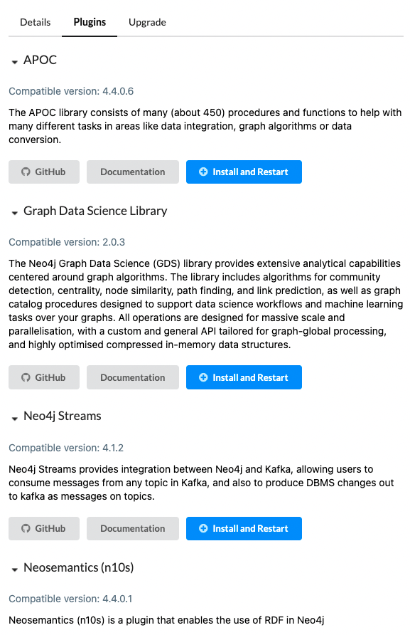

# GDS 簡單介紹



若使用 desktop 可放在

- 基本結構
    
    ```sql
    CALL gds[.<tier>].<algorithm>.<execution-mode>[.<estimate>](
      graphName: String,
      configuration: Map
    )
    ```
    
- Execution mode
    - stream
        - 標準的查找模式，也是 cypher 的預設執行模式
        - 不擅長處理大數據，因此通常搭配使用 “top N-style” 的模式執行
        
    - stats
        - 將演算法的結果統計輸出（次數 or 百分比）
        - 不會對任何的東西做更改
        - 是 mutate 和 write 的基礎
        
    - mutate （變異）
        - 將統計結果寫回 projected graph （也就是被計算的 graph）
        - 可將複數的演算法寫在一起，無需再額外寫入 projected
            - 某些演算法有互相依賴的問題
            - 可直接將結果 轉換成 cypher （原本須額外的轉換 gds.util.nodeproperty）
            
    - write
        - 與 mutate 相似，可將統計結果直接寫進去 DB
            - projected graph 是被存在 memory 的 graph
    
- 使用 estimate 來估計運算資源！
    
    > If the estimation shows that there is a very high probability of the execution going over its memory limitations, the execution is prohibited
    > 
    
    [Memory Estimation - Neo4j Graph Data Science](https://neo4j.com/docs/graph-data-science/current/common-usage/memory-estimation/#estimate-heap-control)
    
- 關於 graph catalog
    - catalog 是 將圖給提取出來放置記憶體中進行運算或研究（開發使用）
    - 延伸問題：如果有這個，還會需要radis 嗎？（開發的時候）
    
    [Graph Catalog - Neo4j Graph Data Science](https://neo4j.com/docs/graph-data-science/current/management-ops/graph-catalog-ops/)
    
    常用的指令可以查看上面的網頁
    
    
    
    - 加入 graph catalog 需備三個基本元素
        - graph name
        - node
        - relation
    - 加入的方法可以分為三種
        - native projection （預設）
            
            
            
            
            
        - cypher
            
            
            
            使用 cypher 找到需要的 node 與 relations ，並將點與關係轉換為 id 後回傳
            
            node: 須轉換 id、對應的 label，其餘的會作為 properties
            
            relation: id、realation type，其餘的會作為 properties
            
        - aggregation
            - 傳入指定的點
            - 還要研究一下
        - project graph 是 user define 的，當你切換ㄕ

# algorithms 分類

## PageRank


```sql
CALL gds.graph.project(
  'myGraph',
  'Page',
  'LINKS',
  {
    relationshipProperties: 'weight'
  }
)
```

### Estimate


### Stream output


